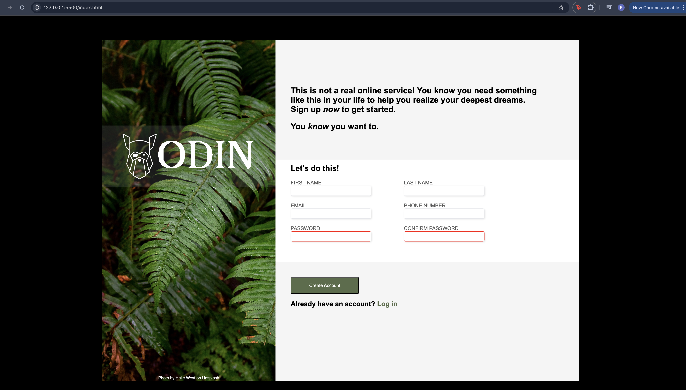

# project-sign-up-form

This is just a project to develop vanilla CSS styling utilizing mainly flexbox. Learning some more CSS without frameworks. Following Odin Project curriculum.

If you'd like to see this just pull the repo and run the index.html file via a local server.

